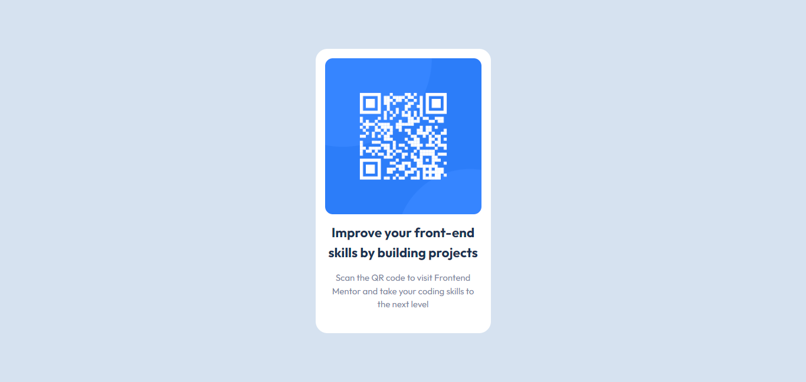

# Frontend Mentor - Product preview card component solution

This is a solution to the [Product preview card component challenge on Frontend Mentor](https://www.frontendmentor.io/challenges/product-preview-card-component-GO7UmttRfa). Frontend Mentor challenges help you improve your coding skills by building realistic projects. 

## Table of contents

- [The challenge](#the-challenge)
- [Screenshot](#Screenshot)
- [Links](#links)
- [My process](#my-process)
- [Built with](#built-with)
- [What I learned](#what-i-learned)
- [Continued development](#continued-development)
- [Useful resources](#useful-resources)
- [Author](#author)

### The challenge

Build out this QR code component and get it looking as close to the design as possible.

- View the optimal layout depending on their device's screen size

### Screenshot

### Links

- Solution URL: [Add solution URL here](https://github.com/martinorue/qr-code-component)
- Live Site URL: [Add live site URL here]()

## My process

In this challenge I wanted to apply the following topics that I have been studying: 

- mobile first approach
- BEM naming convention
- Semantic HTML
- Custom Properties-CSS variables

### Built with

- Flexbox
- CSS Grid
- Mobile-first workflow

### What I learned

- SVG
- media queries
- CSS units
- background-position

### Continued development

- Semantic HTML
- media queries
- Positioning

### Useful resources

https://www.freecodecamp.org/news/taking-the-right-approach-to-responsive-web-design/

https://www.w3schools.com/css/css_rwd_intro.asp

https://www.freecodecamp.org/learn/2022/responsive-web-design/

https://web.dev/learn/design/

## Author

- Frontend Mentor - [@martinorue](https://www.frontendmentor.io/profile/martinorue)
