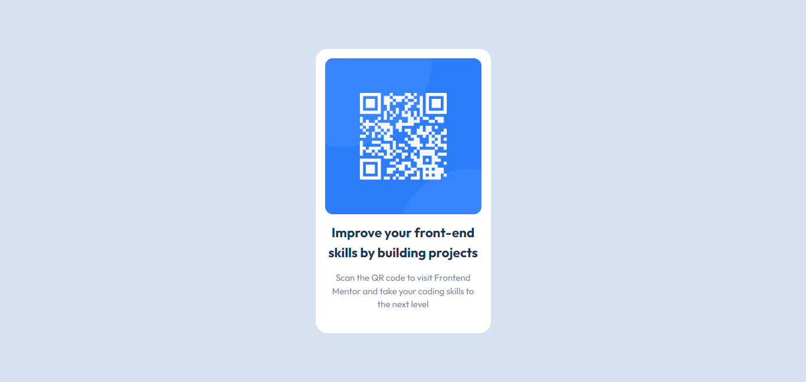

# Frontend Mentor - QR code component

This is a solution to the [QR code component](https://www.frontendmentor.io/challenges/qr-code-component-iux_sIO_H). Frontend Mentor challenges help you improve your coding skills by building realistic projects. 

## Table of contents

- [The challenge](#the-challenge)
- [Screenshot](#Screenshot)
- [Links](#links)
- [My process](#my-process)
- [Built with](#built-with)
- [What I learned](#what-i-learned)
- [Continued development](#continued-development)
- [Useful resources](#useful-resources)
- [Author](#author)

### The challenge

Build out this QR code component and get it looking as close to the design as possible.

- View the optimal layout depending on their device's screen size

### Screenshot

### Links

- Solution URL: (https://github.com/martinorue/qr-code-component)
- Live Site URL: (https://martinorue.github.io/qr-code-component/)

## My process

In this challenge I wanted to apply the following topics that I have been studying: 

- mobile first approach
- BEM naming convention
- Semantic HTML

### Built with

- Flexbox
- Mobile-first workflow

### What I learned

- BEM naming convention
- Semantic HTML 

### Continued development

- media queries
- Positioning
- Custom Properties-CSS variables

### Useful resources

(https://developer.mozilla.org/en-US/docs/Web/HTML/Element#content_sectioning)

(https://www.youtube.com/watch?v=SLjHSVwXYq4)

## Author

- Frontend Mentor - [@martinorue](https://www.frontendmentor.io/profile/martinorue)
